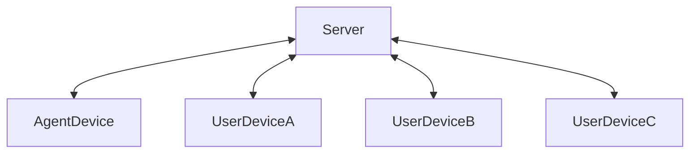
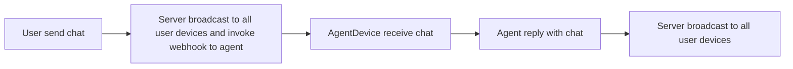

# CLAUDE

Chat server to communicate with openclaw, which is built on tailscale vpn.

## Architecture

```mermaid
graph TD;
    Server <--> AgentDevice
    Server <--> UserDeviceA
    Server <--> UserDeviceB
    Server <--> UserDeviceC
```

```mermaid
graph LR;
    A["User send chat"] --> B["Server broadcast to all user devices and invoke webhook to agent"]
    B --> C["AgentDevice receive chat"]
    C --> D["Agent reply with chat"]
    D --> E["Server broadcast to all user devices"]
```

## Skills

- Language: Go
- Database: CouchBase (chat storage), SQLite (devices storage)
